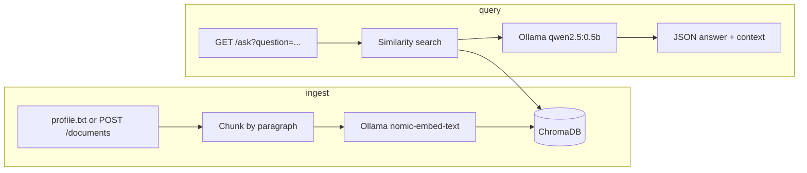
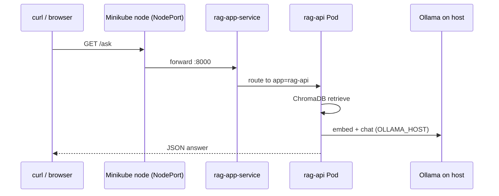

# RAG API

A small **Retrieval-Augmented Generation (RAG)** API built with [FastAPI](https://fastapi.tiangolo.com/), [ChromaDB](https://www.trychroma.com/), and [Ollama](https://ollama.com/). It stores profile-style documents as vector embeddings, retrieves the most relevant chunks for a question, and answers using a local LLM.

Supports a **seed knowledge base** from `profile.txt`, **runtime ingestion** of additional profiles per user via the API, and deployment to **Docker** or **Kubernetes (Minikube)** with a configurable Ollama endpoint.

## Features

- **RAG pipeline**: retrieve relevant chunks → augment the prompt → generate with Ollama (`qwen2.5:0.5b`)
- **Persistent vector store**: ChromaDB on disk (`chroma_db/`)
- **Multi-user documents**: optional `user` filter on `/ask` using ChromaDB metadata
- **Configurable Ollama URL**: `OLLAMA_HOST` environment variable (embeddings and the Ollama Python client)
- **Interactive API docs**: Swagger UI at `/docs`
- **Container-ready**: Docker image with pre-built `chroma_db`
- **Kubernetes manifests**: `deployment.yaml` + `service.yaml` for local Minikube deployment

## How it works



1. **Ingest**: text is split on blank lines (paragraphs), embedded with `nomic-embed-text`, and stored in the `personal_profile` collection.
2. **Ask**: the question is embedded, ChromaDB returns the top matches, and the LLM answers using that context.

### Diagrams

| RAG workflow | Kubernetes deployment | CI/CD pipeline |
|--------------|----------------------|----------------|
|  |  |  |

## Prerequisites

- **Python 3.11+** (3.13 works locally; the Docker image uses 3.11)
- **[Ollama](https://ollama.com/download)** running on the host (`http://localhost:11434` by default)
- Models pulled once:

```bash
ollama pull nomic-embed-text
ollama pull qwen2.5:0.5b
```

Verify Ollama is up:

```bash
curl http://localhost:11434
```

For **Kubernetes on Minikube** (macOS):

```bash
brew install minikube kubectl
minikube start
```

## Project structure

```
rag-api/
├── main.py                  # FastAPI app (/documents, /ask); reads OLLAMA_HOST
├── build_knowledge_base.py  # One-off script: profile.txt → chroma_db (host only)
├── profile.txt              # Sample profile for the initial knowledge base
├── chroma_db/               # ChromaDB data (build on host before docker build)
├── Dockerfile
├── deployment.yaml          # Kubernetes Deployment (rag-app image, OLLAMA_HOST env)
├── service.yaml             # NodePort Service on port 8000
├── Not_multiuser_main.py    # Earlier single-user variant (reference)
└── README.md
```

## Local setup

### 1. Virtual environment and dependencies

```bash
python3 -m venv venv
source venv/bin/activate   # Windows: venv\Scripts\activate
pip install fastapi uvicorn chromadb ollama
```

### 2. Build the knowledge base

Edit `profile.txt` if you want your own seed content, then (with Ollama running on the host):

```bash
python build_knowledge_base.py
```

Expected output:

```
Loaded N chunks from profile.txt
Added N chunks to the 'personal_profile' collection.
Knowledge base built successfully!
```

`build_knowledge_base.py` still uses `http://localhost:11434` directly; run it on the host where Ollama is available.

### 3. Run the API

```bash
uvicorn main:app --reload
```

- API: http://127.0.0.1:8000  
- Swagger UI: http://127.0.0.1:8000/docs  

Ollama must stay running for `/ask` and for new `/documents` (embeddings on add).

## API reference

### `POST /documents`

Add a user profile. Body (JSON):

| Field        | Type   | Description                                         |
|-------------|--------|-----------------------------------------------------|
| `user_name` | string | Identifier stored in chunk metadata                 |
| `content`   | string | Profile text; paragraphs separated by blank lines   |

```bash
curl -X POST "http://127.0.0.1:8000/documents" \
  -H "Content-Type: application/json" \
  -d '{
    "user_name": "alice",
    "content": "My name is Alice.\n\nI enjoy climbing and coffee."
  }'
```

### `GET /ask`

| Query param | Required | Description                                      |
|-------------|----------|--------------------------------------------------|
| `question`  | yes      | Natural-language question                        |
| `user`      | no       | If set, only search chunks with that `user_name` |

```bash
curl -G "http://127.0.0.1:8000/ask" \
  --data-urlencode "question=Who likes hiking?"
```

```bash
curl -G "http://127.0.0.1:8000/ask" \
  --data-urlencode "question=What are their hobbies?" \
  --data-urlencode "user=alice"
```

Example response:

```json
{
  "question": "Who likes hiking?",
  "answer": "...",
  "context_used": ["...", "..."],
  "filtered_by_user": null
}
```

## Configuration

| Setting           | Where                         | Default / notes |
|-------------------|-------------------------------|-----------------|
| `OLLAMA_HOST`     | env var; read in `main.py`    | `http://localhost:11434` — used for embeddings; also picked up by the `ollama` Python client for chat |
| Embedding model   | `OllamaEmbeddingFunction`     | `nomic-embed-text` |
| Chat model        | `ollama.chat` in `main.py`    | `qwen2.5:0.5b` |
| ChromaDB path     | `PersistentClient`            | `./chroma_db` |
| Collection name   | `get_or_create_collection`    | `personal_profile` |
| Chunks per query  | `n_results` in `/ask`           | `2` |

In `main.py`, the Ollama URL is no longer hardcoded:

```python
ollama_host = os.getenv("OLLAMA_HOST", "http://localhost:11434")
ef = OllamaEmbeddingFunction(model_name="nomic-embed-text", url=ollama_host)
```

Use a full URL including the scheme, e.g. `http://host.docker.internal:11434`.

## Docker

The image copies a **pre-built** `chroma_db` and does not run `build_knowledge_base.py` during `docker build` (Ollama is not available at build time).

```bash
# On the host, with Ollama running:
ollama pull nomic-embed-text
python build_knowledge_base.py

docker build -t rag-app .
docker run -p 8000:8000 \
  -e OLLAMA_HOST=http://host.docker.internal:11434 \
  rag-app
```

On **Docker Desktop** (macOS/Windows), `host.docker.internal` reaches Ollama on your machine. On Linux you may need `--add-host=host.docker.internal:host-gateway`.

## Kubernetes (Minikube)

Deploy the API in-cluster while Ollama runs on the host. The pod reaches the host via `host.docker.internal` (set in `deployment.yaml`).

### 1. Build the image inside Minikube

```bash
eval $(minikube docker-env)
docker build -t rag-app .
```

`imagePullPolicy: Never` in `deployment.yaml` expects the image to exist in Minikube’s Docker daemon, not a remote registry.

### 2. Apply manifests

```bash
kubectl apply -f deployment.yaml
kubectl apply -f service.yaml
kubectl get deployments
kubectl get pods
kubectl get services
```

**Deployment** (`deployment.yaml`):

- Image: `rag-app`, 1 replica, container port `8000`
- Env: `OLLAMA_HOST=host.docker.internal:11434` (consider `http://host.docker.internal:11434` if connections fail)

**Service** (`service.yaml`):

- `NodePort` exposing port `8000` → pods labeled `app: rag-api`

### 3. Access the API

```bash
minikube service rag-app-service --url
```

Use the printed URL (for example `http://127.0.0.1:54082`):

```bash
curl -G "http://127.0.0.1:54082/ask" \
  --data-urlencode "question=Who likes climbing?"
```

### 4. After code or image changes

```bash
eval $(minikube docker-env)
docker build -t rag-app .
kubectl rollout restart deployment/rag-app-deployment
kubectl get pods -w
minikube service rag-app-service --url
```

### Request path (cluster → Ollama on host)



## Troubleshooting

| Symptom | Likely cause |
|--------|----------------|
| `ConnectionError: Failed to connect to Ollama` | Ollama not running, or wrong `OLLAMA_HOST` |
| `500` on `/ask` in Kubernetes with hardcoded `localhost` | Pod cannot reach host Ollama; set `OLLAMA_HOST` (fixed in current `main.py`) |
| Docker build fails on `RUN python build_knowledge_base.py` | Remove that step; pre-build `chroma_db` on the host (current Dockerfile) |
| Image not found in Minikube | Run `eval $(minikube docker-env)` before `docker build` |
| Empty or irrelevant answers | Re-run `build_knowledge_base.py` or add content via `/documents` |
| Model not found | `ollama pull nomic-embed-text` and `ollama pull qwen2.5:0.5b` |

## Development notes

- **`Not_multiuser_main.py`**: earlier version without per-user metadata filtering.
